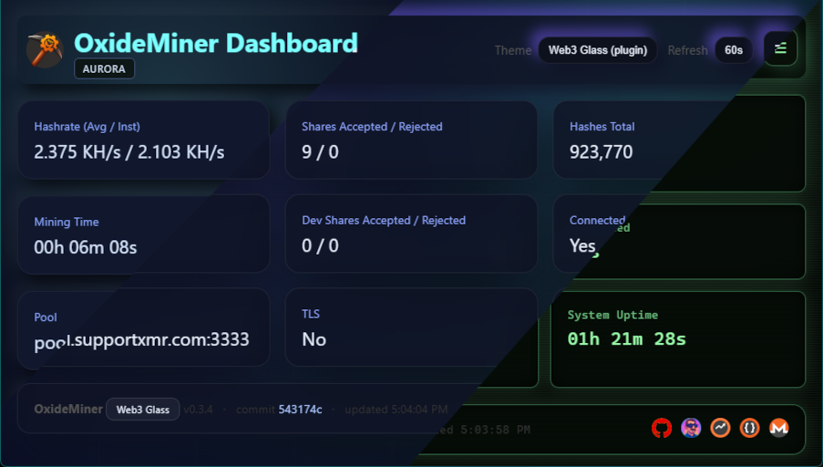

# OxideMiner: High-Performance Monero (XMR) CPU Miner in Rust

[](https://github.com/raystanza/OxideMiner/actions/workflows/release.yml)
[](https://github.com/raystanza/OxideMiner/releases)
[](https://github.com/raystanza/OxideMiner/releases)
[](LICENSE)


**OxideMiner** is a **next-generation RandomX CPU miner** written entirely in **Rust**. Engineered for _speed, safety, and full transparency_.
It’s built to squeeze every cycle from your CPU while keeping your system secure and predictable.
No hidden payloads, no opaque binaries...just verifiable, auditable performance.

We ship a **command-line miner** with automatic CPU tuning, an **optional embedded dashboard**, and hardened controls for TLS, logging, and system friendliness. Every byte of it compiles from the code you see here.

**Performance meets integrity.** OxideMiner is what happens when modern Rust engineering meets Monero’s RandomX algorithm. Optimized for real-world rigs and safe for production hosts.

> **Note:** This is an early-stage release. Expect rough edges while we stabilize and benchmark across more hardware.
> Bug reports and tuning data are especially valuable at this stage.

---

## Table of contents

- [Highlights](#highlights)
- [Quick start](#quick-start)
  - [Super-Quick start](#super-quick-start)
  - [Build from source](#build-from-source)
  - [Prerequisites](#prerequisites)
  - [Build and install](#build-and-install)
  - [First run](#first-run)
- [Downloading and Verifying Releases](#downloading-and-verifying-releases)
- [Configuration](#configuration)
  - [Huge / Large Pages](#huge--large-pages)
    - [Windows](#windows)
    - [Linux](#linux-debian--ubuntu)
  - [Command-line flags](#command-line-flags)
  - [Sample `config.toml`](#sample-configtoml)
  - [Configuration warnings](#configuration-warnings)
- [Operating the miner](#operating-the-miner)
  - [Benchmark mode](#benchmark-mode)
  - [Pool connectivity](#pool-connectivity)
  - [Solo mining (monerod)](#solo-mining-monerod)
  - [Huge pages & affinity](#huge-pages--affinity)
  - [HTTP dashboard & API](#http-dashboard--api)
  - [Metrics reference](#metrics-reference)
- [Responsible usage](#responsible-usage)
- [Developer notes](#developer-notes)
  - [Workspace layout](#workspace-layout)
  - [Building & testing](#building--testing)
  - [Contributing](#contributing)
- [License](#license)
- [Acknowledgments](#acknowledgments)
- [Contact](#contact)

## Highlights

> **TL;DR** OxideMiner aims to be _the most transparent, secure, and efficient RandomX CPU miner ever written in Rust._

- ⚡ **Rust-first CPU miner:** Built from the ground up in Rust for memory safety and predictable performance; with **no C glue, no unsafe shortcuts**. The `oxide-core` crate implements the RandomX hot loop, while `oxide-miner` orchestrates worker threads through Tokio for maximum throughput and minimal overhead.

- 🧠 **Auto-tuned intelligence:** At startup, OxideMiner introspects your CPU topology and cache sizes to pick the perfect thread count and batch size. You can always override them so you can squeeze every last drop of performance from you CPU.

- 🔒 **TLS-ready stratum client:** Secure pool connectivity via `--tls`, with optional certificate pinning and custom CA support.

- 📈 **Prometheus-compatible metrics:** The `/metrics` endpoint exposes rich counters and gauges, ready for Grafana dashboards or cluster monitoring.

- 🪶 **Clean, structured logs:** Human-readable by default, detailed under `--debug`. Rotating log files keep long runs tidy.

- 💎 **Transparent dev fee:** A fixed 1% developer fee, clearly logged and accounted for in metrics. No stealth mining, no surprises, just honesty.

- 📊 **Built-in dashboard (with themes!):** A modern, static web UI (HTML/CSS/JS fully embedded in the binary) shows hashrate, shares, uptime, connection state, and build metadata.


Now with extensible _Themes_ like `aurora` and `retro`


## Quick start

### Super-Quick start

Download a pre-built binary from the [Relases](https://github.com/raystanza/OxideMiner/releases/) page, copy and rename 'config.toml.example' -> 'config.toml', fill in your desired pool & wallet address, run the miner:

> **Windows**: .\oxide-miner.exe  
> **Linux**: ./oxide-miner

_By default OxideMiner will look for a 'config.toml' file in the same directory as the binary, but you can supply the '--config \<PATH_to_CONFIG.TOML>' argument._

> [CLI Screenshot](oxideminer_cli_screenshot.png)

## Build from source

### Prerequisites

> The steps below are for if you want to build from source.

- Rust toolchain via [rustup](https://rustup.rs/) (stable channel). The workspace targets _Rust 2021 edition_.
- A Monero-compatible mining pool endpoint and wallet address.
- For solo mining: a fully-synced local `monerod` with JSON-RPC enabled.
- Optional: elevated privileges for huge/large page support (see below).

### Build and install

#### Clone the repository

```bash
git clone https://github.com/raystanza/OxideMiner.git
cd OxideMiner
```

#### Pick your compile method

OxideMiner supports multiple build configurations, depending on whether you want **maximum compatibility** or **maximum performance on a specific machine**.

```bash
cargo build --release
    [OR]
cargo build --profile maxperf
    [OR]
RUSTFLAGS="-C target-cpu=native" cargo build --profile maxperf
```

**Explanation of each option:**

- **`cargo build --release`**
  Builds OxideMiner using Cargo’s standard `release` profile.
  This produces a **portable, optimized binary** suitable for distribution and for running on a wide range of CPUs.
  Runtime CPU feature detection (AES, AVX2, etc.) is used to select the best available RandomX code paths at execution time.

- **`cargo build --profile maxperf`**
  Builds using OxideMiner’s custom `maxperf` profile, which enables more aggressive compiler optimizations (e.g. fat LTO, single codegen unit, stripped symbols).
  This improves performance while **remaining portable** across different CPUs.
  Recommended if you want better performance than `--release` without sacrificing compatibility.

- **`RUSTFLAGS="-C target-cpu=native" cargo build --profile maxperf`**
  Builds a **host-optimized binary** tuned specifically for the CPU on the machine performing the build.
  LLVM is allowed to fully specialize code generation for the host CPU (e.g. aes_ni, ssse3, avx2, avx512f, sse2).
  This typically yields the **highest possible hash rate**, but the resulting binary **may not run on other machines**.

> **Recommendation:**
>
> - Use `--release` for general use and distribution.
> - Use `--profile maxperf` for improved performance with broad compatibility.
> - Use `--profile maxperf` **with `target-cpu=native`** when building for a specific machine and **absolute maximum performance** is desired.

#### Install executable on your PATH (optional, Debian Linux)

```bash
install -Dm755 target/release/oxide-miner "$HOME/.local/bin/oxide-miner"
```

> The CLI can also be run directly with `cargo run -p oxide-miner --release -- <flags>` while testing changes.

### First run

Prefer the `config.toml` file for your first run. Copy `config.toml.example` to `config.toml`, fill in your pool and wallet, then run the miner.

```bash
# Preferred: config.toml in the same directory as the binary
./oxide-miner
```

By default OxideMiner looks for `config.toml` alongside the binary. Use `--config <PATH>` to point at a different file.

Command-line flags are also available if you prefer to launch without a config file:

```bash
# Example: plaintext stratum connection with HTTP dashboard on localhost (127.0.0.1:8080 by default)

oxide-miner \
  --url <Your.Pool.of.Choice:Port> \
  --user <YOUR_MONERO_WALLET> \
  --pass rig001 \
  --api-port 8080
```

Use `--api-bind <ADDR>` (for example `--api-bind 0.0.0.0`) if you need the dashboard reachable beyond `127.0.0.1`.

For solo mining against a local `monerod`, use `--mode solo` (see the Solo mining section below).

Expected startup log flow:

1. CPU introspection and auto-tune summary (threads, batch size, cache, NUMA, huge page availability).
2. RandomX dataset initialization and worker spawn.
3. Stratum handshake with the configured pool, including dev-fee scheduler announcements.
4. HTTP API availability (if `--api-port` is set.)

## Downloading and Verifying Releases

The project publishes signed release artifacts on the [GitHub Releases](https://github.com/raystanza/OxideMiner/releases) page.
Each release includes compressed binaries (`.tar.gz` for Linux, `.zip` for Windows), matching SHA-256 checksum files, and detached
GPG signatures (`.asc`). Always verify downloads before running them to protect against tampering.

### 1. Download the official artifacts

1. Visit the [Releases](https://github.com/raystanza/OxideMiner/releases) page and choose the tag you want (for example, `v0.3.7`).
2. Download the archive for your operating system and the accompanying checksum (`.sha256`). Download the `.asc` signature files as well.

### 2. Verify SHA-256 checksums

Validating checksums ensures that the file you downloaded matches what the release workflow produced.

#### Debian/Ubuntu (and other GNU/Linux distributions)

```bash
# Replace the filenames with the release assets you downloaded
sha256sum -c oxide-miner-v0.3.7-x86_64-ubuntu-linux-gnu.sha256
```

The command reports `OK` when the archive’s digest matches the expected value. If it fails, delete the file immediately and
re-download it from the official release page.

#### Windows 10/11 (Command Prompt)

```cmd
:: Replace the file names with the versions you downloaded
certutil -hashfile oxide-miner-v0.3.7-x86_64-pc-windows-msvc.zip SHA256
```

Compare the printed hash with the value inside `oxide-miner-v0.3.7-x86_64-pc-windows-msvc.zip.sha256`. The values must match exactly.

#### Windows 10/11 (PowerShell)

```powershell
# Replace the file names with the versions you downloaded
Get-FileHash .\oxide-miner-v0.3.7-x86_64-pc-windows-msvc.zip -Algorithm SHA256
```

Compare the `Hash` field in the output with the value in the `.sha256` file. If they differ, do not run the binary.

### 3. Verify GPG signatures (recommended)

GPG signatures offer an additional guarantee that the release was produced by the OxideMiner maintainers.

### 1. Import the OxideMiner release signing key

We include it as `release-subkey-ci-public-20251012.asc` in this repository and on [https://raystanza.uk](https://raystanza.uk).

```bash
# Linux / macOS
curl -O https://raw.githubusercontent.com/raystanza/OxideMiner/main/release-subkey-ci-public-20251012.asc
gpg --import release-subkey-ci-public-20251012.asc

# Or fetch it by fingerprint from a keyserver
gpg --keyserver hkps://keys.openpgp.org --recv-keys FDA06CAE264DAC0D29B03F5195EDEDFDCB4DD826
```

### 2. Verify the signature for the archive (and the checksum file)

Debian / Ubuntu Linux

```bash
gpg --verify oxide-miner-v0.3.7-x86_64-ubuntu-linux-gnu.tar.gz.asc oxide-miner-v0.3.7-x86_64-ubuntu-linux-gnu.tar.gz
gpg --verify oxide-miner-v0.3.7-x86_64-ubuntu-linux-gnu.sha256.asc oxide-miner-v0.3.7-x86_64-ubuntu-linux-gnu.sha256
```

On Windows PowerShell, use the same commands inside `gpg` (installed with Git for Windows or Gpg4win):

```powershell
gpg --verify oxide-miner-v0.3.7-x86_64-pc-windows-msvc.zip.asc oxide-miner-v0.3.7-x86_64-pc-windows-msvc.zip
gpg --verify oxide-miner-v0.3.7-x86_64-pc-windows-msvc.sha256.asc oxide-miner-v0.3.7-x86_64-pc-windows-msvc.sha256
```

### 3. Confirm the signing key’s fingerprint matches the fingerprint published by the project maintainer ([@raystanza](https://github.com/raystanza/))

**If it does not**, discard the artifacts and investigate before proceeding!

Only run the miner when both the checksum and signature verifications succeed. This defense-in-depth approach reduces exposure to malicious mirrors and supply-chain attacks.

## Configuration

### Huge / Large pages

You can find auditable scripts for both Debian / Ubuntu Linux (Bash) and Windows 10/11 (PowerShell) in the 'scripts/...' folder.
It is recommended that you enable Huge / Large pages support for your OS and you should find a significant hashrate performance boost.

#### Windows

From the 'scripts/windows' directory, run the following:

```powershell
.\Enable-LargePages.ps1
```

> Note: You should run the PowerShell script as an Administrator.  
> After running, reboot for changes to take effect.

#### Linux (Debian / Ubuntu)

From the 'scripts/linux' directory, run the following:

```bash
chmod +x enable_hugepages.sh
./enable_hugepages.sh
```

> Note: You may need 'sudo' privileges for the script to run.  
> After running, log out and back in for changes to take effect.

### Command-line flags

Run `oxide-miner --help` (or `cargo run -p oxide-miner -- --help`) to view all options. Key flags include:

| Flag                      | Purpose                                                                                    |
| ------------------------- | ------------------------------------------------------------------------------------------ |
| `--mode <pool\|solo>`     | Mining backend selection (default `pool`).                                                 |
| `-o, --url <HOST:PORT>`   | Mining pool endpoint (pool mode only).                                                     |
| `-u, --user <ADDRESS>`    | Primary Monero wallet or subaddress (pool mode only).                                      |
| `-p, --pass <STRING>`     | Pool password/rig identifier (default `x`).                                                |
| `-t, --threads <N>`       | Override auto-selected worker threads.                                                     |
| `--batch-size <N>`        | Manual hashes per batch (default auto recommendation).                                     |
| `--no-yield`              | Disable cooperative yields between batches (less friendly to shared hosts).                |
| `--affinity`              | Pin worker threads to CPU cores.                                                           |
| `--huge-pages`            | Request large pages for RandomX dataset (requires OS support).                             |
| `--proxy <URL>`           | Route stratum traffic via SOCKS5 proxy. Format: `socks5://[user:pass@]host:port`.          |
| `--tls`                   | Enable TLS for the stratum connection.                                                     |
| `--tls-ca-cert <PATH>`    | Add a custom CA certificate (PEM/DER) when TLS is enabled.                                 |
| `--tls-cert-sha256 <HEX>` | Pin the pool certificate by SHA-256 fingerprint.                                           |
| `--api-port <PORT>`       | Expose the dashboard/API on the given port (paired with `--api-bind`).                     |
| `--api-bind <ADDR>`       | Address to bind the HTTP API/dashboard (default `127.0.0.1`, only used with `--api-port`). |
| `--dashboard-dir <DIR>`   | Serve dashboard assets from disk instead of embedded versions.                             |
| `--debug`                 | Increase log verbosity and tee output to rotating files in `./logs/`.                      |
| `--config <PATH>`         | Load defaults from a TOML file (defaults to `./config.toml`).                              |
| `--benchmark`             | Run the RandomX benchmark and exit (no pool connection).                                   |
| `--node-rpc-url <URL>`    | Monerod JSON-RPC endpoint for solo mining (default `http://127.0.0.1:18081`).              |
| `--node-rpc-user <USER>`  | Monerod JSON-RPC username (HTTP digest auth).                                              |
| `--node-rpc-pass <PASS>`  | Monerod JSON-RPC password (HTTP digest auth).                                              |
| `--solo-wallet <ADDRESS>` | Wallet address for solo mining (`get_block_template`).                                     |
| `--solo-reserve-size <N>` | Reserve size in bytes for solo templates (default 60).                                     |
| `--solo-zmq <URL>`        | Optional ZMQ endpoint for new-block notifications (polling fallback).                      |

### Sample `config.toml`

The repository ships with [`config.toml.example`](config.toml.example). Copy it alongside the binary as `config.toml` and edit the keys you need. CLI flags always win over file settings.

```toml
# Save as config.toml next to the oxide-miner binary
mode = "pool"
pool = "xmr.kryptex.network:7029"
wallet = "<YOUR_WALLET_ADDRESS>"
pass = "rig001"
threads = 8             # omit to auto-tune
api_port = 8080         # enable HTTP dashboard
api_bind = "127.0.0.1"  # address to bind the dashboard/API (default 127.0.0.1, only used with api_port)
huge_pages = true       # request HugeTLB / large pages if OS allows it

# NOTE: TOML tables do not end; keep [solo] at the bottom unless you start a new table.
[solo]
node_rpc_url = "http://127.0.0.1:18081"
node_rpc_user = "user"
node_rpc_pass = "pass"
wallet = "<YOUR_WALLET_ADDRESS>"
reserve_size = 60
solo_zmq = "tcp://127.0.0.1:18083"
```

### Configuration warnings

`parse_with_config` merges CLI arguments with the TOML file and emits warnings for unexpected keys or missing config files. Warnings print to stderr only when relevant (non-debug messages always show; debug-only items respect `--debug`). Treat these as prompts to fix typos before mining.

## Operating the miner

### Benchmark mode

Run `--benchmark` to skip pool connectivity and measure local RandomX throughput. The benchmark:

- Performs the same CPU feature detection and auto-tuning as normal operation.
- Honors manual overrides (`--threads`, `--batch-size`, `--huge-pages`, `--no-yield`).
- Executes a fixed-duration hashing loop (20 seconds) and reports hashes per second via structured logs.

> OxideMiner’s benchmark isn’t synthetic fluff. It’s the _exact_ mining loop used in production, giving you a realistic, apples-to-apples performance baseline. This is useful for validating huge-page configuration, BIOS tweaks, or regression testing after code changes.

### Pool connectivity

- OxideMiner currently targets CPU mining via the stratum protocol; no GPU offload is implemented.
- TLS is optional. When enabled, combine `--tls` with `--tls-ca-cert` for self-hosted pools or `--tls-cert-sha256` to guard against MITM attacks.
- Route pool traffic through a SOCKS5 proxy with `--proxy socks5://[user:pass@]host:port` when you need Tor/VPN privacy or to bypass network restrictions.
- Developer fee shares (1%) are scheduled deterministically and use the hard-coded donation wallet. Their acceptance/rejection counts are tracked separately in logs, metrics, and the dashboard.
- Reconnection logic backs off exponentially between attempts. Watch for log lines prefixed with `reconnect` if the pool is unavailable.

### Solo mining (monerod)

Solo mode mines directly against a local, fully-synced `monerod` via JSON-RPC. OxideMiner does **not** store the blockchain itself.
When `--rpc-login` is enabled, monerod uses HTTP Digest authentication; set `--node-rpc-user` and `--node-rpc-pass` to match.

Run `monerod` with RPC enabled (localhost only recommended):

```bash
monerod \
  --data-dir "~/xmr/" # Wherever the parent folder of lmdb is.
  --rpc-bind-ip 127.0.0.1 \
  --rpc-bind-port 18081 \
  --rpc-login user:pass \
  --zmq-pub tcp://127.0.0.1:18083
```

Then start OxideMiner in solo mode:

```bash
oxide-miner \
  --mode solo \
  --solo-wallet <YOUR_MONERO_WALLET> \
  --node-rpc-url http://127.0.0.1:18081 \
  --node-rpc-user user \
  --node-rpc-pass pass
```

ZMQ notifications are optional; OxideMiner currently uses polling with backoff and will log if a ZMQ endpoint is provided.

If the node is still syncing, OxideMiner logs a clear warning and keeps polling until templates are available.

### Huge pages & affinity

RandomX benefits from large pages and deterministic thread placement. OxideMiner surfaces both knobs:

- `--huge-pages` (or `huge_pages = true`) requests 2 MiB pages for the dataset. Success depends on OS configuration; the miner will log warnings when the allocation cannot be satisfied.
- `--affinity` pins worker threads using `core_affinity` to reduce scheduler jitter.

> The options above give RandomX the low-latency memory access it was designed for and prevent CPU scheduler jitter from eating your hashrate.

Helper scripts for system setup live under [`scripts/`](scripts/):

- `scripts/linux/enable_hugepages.sh` reserves HugeTLB pages, mounts `/mnt/hugepages`, and configures Transparent Huge Pages.
- `scripts/windows/Enable-LargePages.ps1` grants the `SeLockMemoryPrivilege` required for large-page allocations on Windows.

Run these scripts with administrative privileges and review their contents before execution. Afterward you'll need to log out and log back in for changes to take effect.

### HTTP dashboard & API

Setting `--api-port` starts the HTTP server on `<api_bind>:<PORT>`. `--api-bind` controls the address (default `127.0.0.1`); if `--api-port` is not set, the bind value is unused. `--api-bind 0.0.0.0 --api-port 8080` exposes it on all interfaces. You can reverse proxy this elsewhere if needed. The following endpoints are served:

- `/` (and `/index.html`): Embedded dashboard UI.
- `/dashboard.css`, `/dashboard.js`, `/img/*`: Embedded static assets. Override via `--dashboard-dir` for local UI development.
- `/plugins/themes`: Default dashboard Themes page (hamburger menu -> Plugins -> Themes).
- `/api/plugins/themes`: JSON manifest of built-in and plugin themes stored under `plugins/themes/`.
- `/api/stats`: JSON payload summarizing hashrate, total hashes, share counts, mining duration, system uptime (via `sysinfo`), pool metadata, and build information.
- `/metrics`: Plain-text metrics for Prometheus and similar collectors.

### Metrics reference

The `/metrics` endpoint currently exports:

```text
oxide_hashes_total <u64>
oxide_hashrate <float>
oxide_shares_accepted_total <u64>
oxide_shares_rejected_total <u64>
oxide_devfee_shares_accepted_total <u64>
oxide_devfee_shares_rejected_total <u64>
oxide_backend_info{mode,endpoint} 1
oxide_node_height <u64>
oxide_template_height <u64>
oxide_template_age_seconds <u64>
oxide_blocks_submitted_total <u64>
oxide_blocks_accepted_total <u64>
oxide_blocks_rejected_total <u64>
oxide_last_submit_success <0|1>
oxide_last_submit_timestamp_seconds <u64>
oxide_last_submit_status{status} 1
oxide_pool_connected <0|1>
oxide_tls_enabled <0|1>
version <string>
commit_hash <string>
commit_hash_short <string>
commit_timestamp <string>
build_timestamp <string>
```

Use these to drive alerting or dashboards. All counters are updated atomically in `Stats` and reflect the same values shown in the web UI.

### Dashboard themes & plugins

- The default dashboard ships with Light, Dark, and Monero themes. Additional themes can be dropped into `plugins/themes/<theme_id>/`.
- Each theme needs a `theme.json` manifest describing the entry CSS (and optional JS/HTML fragments). See [docs/themes.md](docs/themes.md) for the full manifest layout and authoring tips.
- Access the management UI from the hamburger menu -> **Plugins -> Themes** or visit `http://<api_bind>:<port>/plugins/themes` directly (defaults to `http://127.0.0.1:<port>/plugins/themes`).
- If the active theme includes `theme.html` (or `entry_html`), the bundled dashboard entrypoint is served from that file; custom dashboards served via `--dashboard-dir` are never overridden.
- The `--dashboard-dir` flag continues to serve a completely custom dashboard; the theme plugin system only augments the bundled UI.

## Responsible usage

- Mine only on hardware you own or administer with explicit permission.
- Monitor CPU temperatures, power draw, and system stability as RandomX workloads sustain near-100% utilization.
- Keep wallet addresses secure and rotate pool credentials if exposed.
- Understand local regulations regarding cryptocurrency mining.
- Be considerate on shared machines: leave `--no-yield` off unless you fully control the host, and size `--threads` to avoid starving other workloads.

## Developer notes

OxideMiner’s architecture is clean and modular. It is optimized for contribution and inspection.
Rust crates are separated into logical domains (`oxide-core` for the engine, `oxide-miner` for orchestration), ensuring the miner remains maintainable as it grows.

### Workspace layout

```bash
crates/
  oxide-core/        # Mining engine, stratum client, benchmark logic
  oxide-miner/       # CLI binary, HTTP API, configuration parsing, stats
config.toml.example  # Reference configuration
scripts/             # Huge/large page setup helpers for Linux & Windows
plugins/
  themes/            # Built-in themes and pluggable additions.
```

### Building & testing

Common development commands:

```bash
# Format code
cargo fmt

# Lint with warnings treated as errors
cargo clippy --all-targets -- -D warnings

# Run the full test suite (unit + async tests)
cargo test --all

# Run solo RPC integration tests (requires a local monerod)
OXIDE_MONEROD_RPC=http://127.0.0.1:18081 \
OXIDE_SOLO_WALLET=<YOUR_WALLET_ADDRESS> \
cargo test -p oxide-miner --features integration-tests

# Launch the miner in debug mode with verbose logging
cargo run -p oxide-miner -- --debug --benchmark
```

The HTTP API module includes async integration tests that spin up a local server, so expect network bind permissions during `cargo test`.

### Contributing

We welcome issues and pull requests focused on performance, stability, and observability. Before opening a PR:

1. Discuss significant ideas in a GitHub issue so design constraints are documented.
2. Keep patches small and focused; document user-facing changes in the changelog once one exists.
3. Run the commands above (`fmt`, `clippy`, `test`) to maintain build hygiene.
4. Mention hardware, OS, and pool details when reporting performance data or bugs (it helps reproduce results).

## License

OxideMiner is provided under the Business Source License 1.1. Non-production use—including evaluation, internal development, and testing—is permitted under the terms described in [LICENSE](LICENSE). On **2030-01-01** (or, for any given version, the fourth anniversary of its first public release under the BSL, whichever comes first), OxideMiner will transition to the MIT License as the Change License. Commercial production deployments before that date require a separate agreement with the Licensor, Jim Sines ([@raystanza](https://github.com/raystanza)).

## Acknowledgments

- Monero Research Lab and the RandomX authors for publishing a resilient, CPU-friendly proof of work.
- The Rust ecosystem (`tokio`, `hyper`, `tracing`, `serde`, etc.) that powers the async runtime and HTTP layer.
- Early testers providing logs, CPU tuning data, and bug reports that shaped v0.1.0.

## Contact

- GitHub: [@raystanza](https://github.com/raystanza)
- Issues: [https://github.com/raystanza/OxideMiner/issues](https://github.com/raystanza/OxideMiner/issues)
